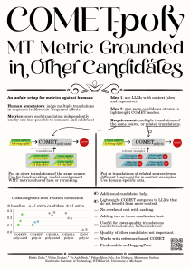

# COMET-poly

> **Title:** COMET-poly: Machine Translation Metric Grounded in Other Candidates
>
> **Abstract:**
> Automated metrics for machine translation evaluate the quality of a translation by attempting to replicate human judgment.
> Unlike humans (who often assess a translation in the context of multiple alternatives) these metrics typically consider only the source sentence and a single translation.
> This discrepancy in evaluation setup may negatively impact the performance of automated metrics.
> We propose two automated metrics approaches that incorporate additional information beyond the single translation.
> COMET-poly-cand incorporates alternative translations of the same source sentence to better contextualize and assess the quality of the translation being scored, which is useful in practice where we often wish to compare multiple candidate translations.
> COMET-poly-ic, inspired by retrieval-based in-context learning, takes in additionally translations of similar source texts with known quality scores to guide the evaluation through contextual examples.
> We find that simply including a single additional translation in the input boosts segment-level metric performance (0.079→0.118 τ_b), with further gains when adding more translations for context.
> Retrieved examples yield similar improvements  (0.079→0.116 τ_b), and the approach shows promise for on-the-fly domain adaptation.

Paper link [arxiv.org/abs/2508.18549](https://arxiv.org/abs/2508.18549).


<!--  -->

This repository contains a version of COMET which supports multiple translations to be scored.

Importantly, this repository hosts the `comet-poly` package, which is a fork of [`unbabel-comet`](https://github.com/Unbabel/COMET/) that is not compatible.
Thus, you need to install this package by:
```
pip install "git+https://github.com/zouharvi/COMET-poly#egg=comet-poly&subdirectory=comet_poly"
```
or alternatively by cloning and installing locally:
```
git clone https://github.com/zouharvi/COMET-poly
cd COMET-poly
pip install -e comet_poly
```

## Running pre-trained models

Our models are published on HuggingFace:
- [huggingface.co/zouharvi/COMET-poly-cand1-wmt25](https://huggingface.co/zouharvi/COMET-poly-cand1-wmt25) requires one additional translation of the same source for more context
- [huggingface.co/zouharvi/COMET-poly-cand2-wmt25](https://huggingface.co/zouharvi/COMET-poly-cand2-wmt25) requires two additional translations of the same source for more context
- [huggingface.co/zouharvi/COMET-poly-ic1-wmt25](https://huggingface.co/zouharvi/COMET-poly-ic1-wmt25) requires one additional in-context example
- [huggingface.co/zouharvi/COMET-poly-ic3-wmt25](https://huggingface.co/zouharvi/COMET-poly-ic3-wmt25) requires three additional in-context examples
- [huggingface.co/zouharvi/COMET-poly-base-wmt25](https://huggingface.co/zouharvi/COMET-poly-base-wmt25) is a standard COMET serving as a contrastive baseline.

Their usage is documented on HuggingFace.
The poly-cand version works as follows:
```python
import comet_poly
model = comet_poly.load_from_checkpoint(comet_poly.download_model("zouharvi/COMET-poly-cand1-wmt25"))
data = [
    {
        "src": "Iceberg lettuce got its name in the 1920s when it was shipped packed in ice to stay fresh.",
        "mt": "Eisbergsalat erhielt seinen Namen in den 1920er-Jahren, als er in Eis verpackt verschickt wurde, um frisch zu bleiben.",
        "mt2": "Eisbergsalat bekam seinen Namen, weil man ihn mit Eis schickte, damit er frisch bleibt.",
    },
    {
        "src": "Goats have rectangular pupils, which give them a wide field of vision—up to 320 degrees!",
        "mt": "Kozy mají obdélníkové zornice, což jim umožňuje vidět skoro všude kolem sebe, aniž by musely otáčet hlavou.",
        "mt2": "Kozy mají obdélníkové zornice, které jim umožňují mít zorné pole až 320 stupňů.",
    },
    {
        "src": "This helps them spot predators from almost all directions without moving their heads.",
        "mt": "Điều này giúp chúng phát hiện kẻ săn mồi từ gần như mọi hướng mà không cần quay đầu.",
        "mt2": "Nhờ vậy, chúng có thể thấy kẻ săn mồi từ hầu hết mọi phía mà không phải xoay đầu.",
    }
]
print("scores", model.predict(data, batch_size=8, gpus=1).scores)
```

And the poly-ic version works as:
```python
import comet_poly
model = comet_poly.load_from_checkpoint(comet_poly.download_model("zouharvi/COMET-poly-ic1-wmt25"))
data = [
    {
        "src": "Iceberg lettuce got its name in the 1920s when it was shipped packed in ice to stay fresh.",
        "mt": "Eisbergsalat erhielt seinen Namen in den 1920er-Jahren, als er in Eis verpackt verschickt wurde, um frisch zu bleiben.",
        "src2": "Lettuce is mostly water, which helps keep it crisp when chilled.",
        "mt2": "Kopfsalat besteht größtenteils aus Wasser, was ihm hilft, beim Kühlen knackig zu bleiben.",
        "score2": 94.5
    },
    {
        "src": "Goats have rectangular pupils, which give them a wide field of vision—up to 320 degrees!",
        "mt": "Kozy mají obdélníkové zornice, což jim umožňuje vidět skoro všude kolem sebe, aniž by musely otáčet hlavou.",
        "src2": "Sheep, like goats, also have rectangular pupils for better peripheral vision.",
        "mt2": "Вівці, як і кози, також мають прямокутні зіниці для кращого периферичного зору.",
        "score2": 96.0
    },
    {
        "src": "This helps them spot predators from almost all directions without moving their heads.",
        "mt": "Điều này giúp chúng phát hiện kẻ săn mồi từ gần như mọi hướng mà không cần quay đầu.",
        "src2": "Many prey animals have evolved to detect threats with minimal movement.",
        "mt2": "Nhiều động vật thịt có tiến hóa để xem mối nguy bằng nhỏ đi lại.",
        "score2": 42.3
    }
]
print("scores", model.predict(data, batch_size=8, gpus=1).scores)
```

In addition, we provide two knn baselines, which are documented in [comet_poly/comet_poly/knn_polycand.py](comet_poly/comet_poly/knn_polycand.py) and [comet_poly/comet_poly/knn_polyic.py](comet_poly/comet_poly/knn_polyic.py).

## Training models and replicating experiments

The scripts for training new COMET models and running the experiments in the paper are in `experiments/`.
First, start by fetching the data:
```
python3 experiments/01-get_data_same.py
python3 experiments/01-get_data_same.py --sort-by-sim # optional, takes a long time
python3 experiments/01-get_data_retrieval.py # see arguments
```

Then train models based on [experiments/03-train_models.sh](experiments/03-train_models.sh).

# Citation

If you use this work, please cite it as:
```bibtex
@misc{züfle2025cometpoly,
      title={COMET-poly: Machine Translation Metric Grounded in Other Candidates}, 
      author={Maike Züfle and Vilém Zouhar and Tu Anh Dinh and Felipe Maia Polo and Jan Niehues and Mrinmaya Sachan},
      year={2025},
      eprint={2508.18549},
      archivePrefix={arXiv},
      primaryClass={cs.CL},
      url={https://arxiv.org/abs/2508.18549}, 
}
```
